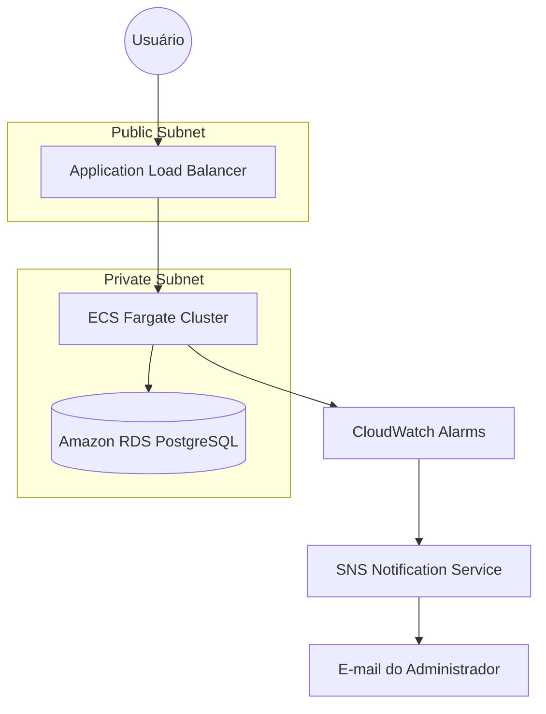

# 🚀 AWS ECS Zabbix Orchestration

[](https://www.terraform.io/)
[](https://aws.amazon.com/)
[](https://www.postgresql.org/)
[](https://aws.amazon.com/cloudwatch/)

Projeto de **Infrastructure as Code (IaC)** para provisionamento de infraestrutura AWS de alta disponibilidade, focada em observabilidade e resiliência, servindo como base para o ecossistema de monitoramento **Zabbix + Grafana** no **Amazon ECS**.

---

### 📌 Visão Geral
Infraestrutura *production-like* de observabilidade na AWS utilizando **Terraform (IaC)** para provisionar um ambiente altamente escalável, tolerante a falhas e seguro contendo:

* **Zabbix** (Monitoramento robusto e coleta de dados)
* **Grafana** (Visualização rica e dashboards analíticos)
* **AWS ECS Fargate** (*Serverless containers orchestration*)
* **Amazon RDS PostgreSQL 15.7** (Persistência de dados gerenciada)
* **AWS Secrets Manager** (Gestão e injeção segura de credenciais)

O projeto simula com precisão uma arquitetura real de produção voltada para engenharia de observabilidade moderna baseada em containers.

---

### 🎯 Objetivo do Projeto
Projetar e demonstrar uma infraestrutura cloud completa com foco em pilares de excelência técnica. Este projeto faz parte do meu portfólio profissional e demonstra a construção de uma infraestrutura AWS moderna. O foco é a evolução contínua, aplicando boas práticas de Engenharia de Confiabilidade (SRE) e automação em ambiente de produção:

* **Infraestrutura como Código (IaC):** Automação total, reprodutibilidade e versionamento de ambiente.
* **Segurança por padrão (DevSecOps):** Mitigação de vulnerabilidades e exposição zero de dados sensíveis.
* **Arquitetura Multi-AZ:** Resiliência e alta disponibilidade distribuída em diferentes zonas.
* **Escalabilidade Serverless:** Computação elástica com ECS Fargate sem gerenciar instâncias de servidores.
* **Observabilidade Centralizada:** Coleta de logs agregados nativamente e foco em *Golden Signals*.

---

# 🏗️ Arquitetura do Sistema

A infraestrutura foi desenhada para garantir isolamento e segurança, utilizando camadas públicas e privadas, protegidas por Load Balancers e monitoradas ativamente.



### 🧠 Decisões Arquiteturais

* **ECS Fargate:** Elimina a complexidade de gestão, patches e escalabilidade de instâncias EC2 tradicionais.
* **RDS em Subnets Privadas:** Isolamento de rede absoluto da camada de banco de dados, sem qualquer exposição à internet pública.
* **AWS PrivateLink (VPC Endpoints):** Comunicação do ECS para downloads de imagens de repositórios e envio de logs de forma 100% interna na rede AWS, dispensando custos com NAT Gateways.
* **Secrets Manager via IAM Data Fetching:** Zero credenciais codificadas (*hardcoded*) no código, injetadas de forma efêmera na memória volátil dos containers.
* **ALB Inteligente:** Entrada pública única e centralizada chaveando tráfego por portas e regras dinâmicas de destino (*Target Groups*).
* **IAM Least Privilege:** Aplicação rígida do princípio de menor privilégio para regras de execução das tarefas.

---

### 📦 Recursos Implementados & Provisionados

* **Infraestrutura Core:** 1x AWS VPC com DNS Hostnames ativado e 4x Subnets (2 públicas para o ALB e 2 privadas para computação/banco) distribuídas em Multi-AZ.
* **Rede Interna:** 3x VPC Endpoints de Interface (ECR API, ECR DKR e Logs) para segurança interna via PrivateLink.
* **Computação:** 1x Amazon ECS Cluster (Container Insights ativo) + 2x Task Definitions (Zabbix Server/Web em Pod multicontainer e Grafana autônomo) + 2x ECS Services.
* **Tráfego:** 1x Application Load Balancer público munido de Listeners nas portas 80 e 3000 + 2x Target Groups do tipo `ip`.
* **Database:** 1x Instância de Banco de Dados Amazon RDS PostgreSQL acoplada a um DB Subnet Group privado + integração com AWS Secrets Manager.
* **Observabilidade:** CloudWatch Dashboards personalizados + Alertas automatizados via SNS.
* **Governança:** Padronização completa de recursos através de `default_tags` para controle de custos e modularização.

---

### 🔒 Segurança (DevSecOps)

A arquitetura foi desenvolvida seguindo estritamente o princípio de **Least Privilege** (Menor Privilégio), implementando:

* **Isolamento de Banco:** Banco de dados privado em sub-redes isoladas, totalmente inacessível externamente e sem associação de IP público.
* **Injeção de Segredos:** Injeção dinâmica de segredos no boot da Task através do parâmetro `secrets` do ECS, sem dados expostos no código.
* **Mínimo Acesso de Rede:** Comunicação restrita horizontalmente através de 4x Security Groups customizados atuando como firewalls estritos com regras isoladas (`aws_security_group_rule`).
* **Segregação de Redes:** Segregação física e lógica de redes através de subnets públicas e privadas bem definidas.

---

### 👁️ Observabilidade & SRE

Para garantir a saúde operacional, o projeto integra monitoramento de ponta a ponta focado nos **Golden Signals**:

* **CloudWatch Dashboard:** Painel centralizado com indicadores de Saturação (CPU/Memória das tarefas ECS), Disponibilidade (Erros 5XX/Latência do ALB) e Persistência (Conexões ativas/CPU do banco RDS).
* **Notificação Proativa:** Integração nativa com AWS SNS para envio imediato de alertas via e-mail em caso de violação de métricas críticas ou falhas de health check.

---

### 📁 Estrutura do Projeto

```text
.
├── providers.tf      # Configuração dos providers e tags padrão de governança
├── variables.tf      # Declaração e tipagem rigorosa das variáveis de entrada
├── network.tf        # Construção da VPC, Subnets Públicas/Privadas e Tabelas de Roteamento
├── endpoints.tf      # VPC Endpoints para PrivateLink do ECR e CloudWatch Logs (sem NAT Gateway)
├── security.tf       # Definição fina de Security Groups e regras de Ingress/Egress (Least Privilege)
├── rds.tf            # Provisionamento do PostgreSQL e integração com Secrets Manager
├── ecs.tf            # Definição do Cluster ECS, Task Definitions, Services e logs agregados
├── alb.tf            # Configuração do Application Load Balancer, Listeners e Target Groups
├── monitoring.tf     # Configuração dos CloudWatch Dashboards e alarmes de métricas
├── sns.tf            # Canais de notificação e tópicos para envio de alertas por e-mail
├── outputs.tf        # Exposição estruturada das URLs públicas pós-deploy
└── dev.tfvars        # Atribuição de valores específicos para o ambiente de Desenvolvimento
```

---

### ⚙️ Pré-requisitos

Antes de iniciar, certifique-se de possuir configurado:
* **Terraform** v1.5 ou superior instalado.
* **AWS CLI** devidamente configurado com as credenciais da sua conta.
* **Secret previamente criado** no AWS Secrets Manager sob o nome exato: `aws-ecs-zabbix-orchestration-rds-secret-v1`

---

### 🚀 Como Executar

**1. Inicializar o ambiente do Terraform**
```bash
terraform init
```

**2. Criar ou selecionar o Workspace dedicado**
```bash
terraform workspace select dev || terraform workspace new dev
```

**3. Validar estaticamente a sintaxe dos arquivos**
```bash
terraform validate
```

**4. Visualizar o plano de execução e alterações planejadas**
```bash
terraform plan -var-file="dev.tfvars"
```

**5. Executar o deploy automatizado na AWS**
```bash
terraform apply -var-file="dev.tfvars"
```

**6. Destruir o ambiente (Limpeza pós-uso)**
```bash
terraform destroy -var-file="dev.tfvars"
```

---

### 🌐 Mapeamento de Outputs e URLs

Ao término do `terraform apply`, o console exibirá de forma estruturada as seguintes rotas públicas para acesso imediato no navegador:

* **Zabbix Web interface:** `http://<alb-dns-name>` (Porta padrão 80 HTTP)
* **Grafana Dashboards:** `http://<alb-dns-name>:3000` (Porta 3000 HTTP)

---

### 🔥 Destaques Técnicos

* **Arquitetura Resiliente Multi-AZ:** Tolerância automática a falhas a nível de datacenter AWS.
* **Mapeamento de Tráfego Interno Avançado:** O ALB recebe requisições na porta 80 e as encaminha de forma transparente para as Tasks na porta 8080 nativa do container Zabbix Web Nginx.
* **Estratégias de Custos Inteligentes:** Uso flexível de Fargate Spot para computação otimizada em ambientes de não-produção.
* **Infraestrutura 100% Reprodutível:** Todo o ecossistema pode ser recriado do zero em minutos com apenas um comando.

---

### 👨‍💻 Autor

**Frederico Almeida**  
*Cloud & DevOps Engineer | AWS | Terraform | Linux*
